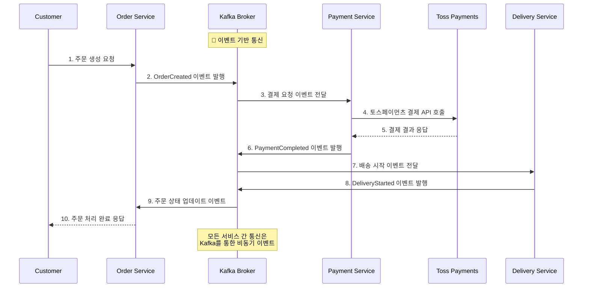
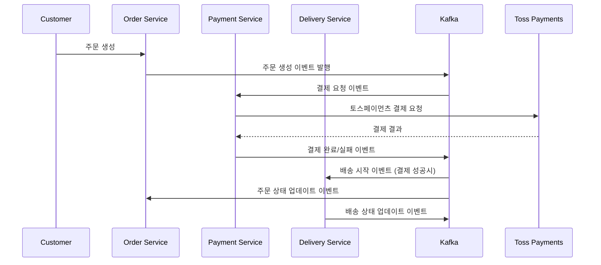
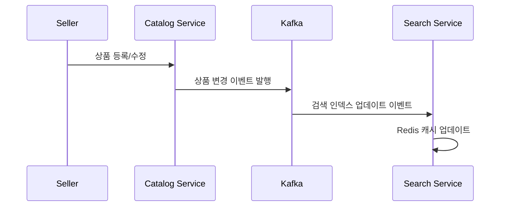

# 이벤트 기반 마이크로서비스 아키텍처

## 시스템 개요

본 시스템은 이벤트 기반 아키텍처(Event-Driven Architecture)를 기반으로 한 마이크로서비스 플랫폼입니다. Apache Kafka를 중심으로 한 메시지 브로커를 통해 서비스 간 비동기 통신을 구현하고, 각 서비스는 독립적인 데이터베이스를 사용하여 느슨한 결합을 유지합니다.


## 아키텍처 다이어그램

### 이벤트 기반 마이크로서비스 구조
```
                    👤 Customer                      👤 Seller
                         |                              |
              ┌──────────┼──────────┐                   |
              |          |          |                   |
              v          v          v                   v
    🔍 Search Service  🛒 Order   👥 Member      📦 Catalog Service
         :8084         Service     Service           :8085
                        :8086       :8081
              |          |          |                   |
              v          v          v                   v
         Redis ────┐     |          |              ┌─ Cassandra
              Cache│     |          |              │   NoSQL
                   │     |          |              │
                   └─────┼──────────┼──────────────┼─────┐
                         │          │              │     │
                         v          v              v     │
                    ┌─────────────────────────────────────┐│
                    │        📨 Apache Kafka              ││
                    │       Event Broker Core             ││
                    │   (3 Brokers + Zookeeper)          ││
                    └─────────────────────────────────────┘│
                         │          │              │     │
                         v          v              v     │
                    💰 Payment  🚛 Delivery       │     │
                     Service     Service          │     │
                      :8082       :8083           │     │
                         |          |             │     │
                         v          v             v     │
                      MySQL ────────┴──────── MySQL ────┘
                      RDBMS                   RDBMS
                         |          |
                         v          v
                 💳 Toss Payments  🚚 External
                   External API    Delivery Service
```

### 핵심 이벤트 플로우


## 서비스 구성

### 🎯 핵심 비즈니스 서비스

| 서비스 | 포트 | 역할 | 데이터베이스 | 특징 |
|--------|------|------|--------------|------|
| **Member Service** | 8081 | 회원 관리, 인증/인가 | MySQL | 사용자 정보 관리 |
| **Catalog Service** | 8085 | 상품 카탈로그 관리 | Cassandra + MySQL | 대용량 상품 데이터 처리 |
| **Search Service** | 8084 | 상품 검색 | Redis | 고성능 검색 캐싱 |
| **Order Service** | 8086 | 주문 처리 | MySQL | 주문 생명주기 관리 |
| **Payment Service** | 8082 | 결제 처리 | MySQL | **토스페이먼츠 연동** |
| **Delivery Service** | 8083 | 배송 관리 | MySQL | 외부 배송업체 연동 |

### 💾 데이터 저장소

#### MySQL (포트: 3306)
- **용도**: 트랜잭션 데이터 저장
- **사용 서비스**: Member, Payment, Delivery, Order, Catalog
- **특징**: ACID 속성이 중요한 비즈니스 데이터

#### Cassandra (포트: 9042)
- **용도**: 대용량 상품 메타데이터
- **사용 서비스**: Catalog Service
- **특징**: 높은 가용성과 확장성

#### Redis (포트: 6379)
- **용도**: 검색 결과 캐싱
- **사용 서비스**: Search Service
- **특징**: 빠른 응답시간

### 📨 이벤트 브로커

#### Apache Kafka 클러스터
```
┌─────────────────────────────────────┐
│          Kafka Cluster              │
├─────────────────────────────────────┤
│ • Zookeeper: 22181                  │
│ • Kafka Broker 1: 19092             │
│ • Kafka Broker 2: 19093             │
│ • Kafka Broker 3: 19094             │
│                                     │
│ • Replication Factor: 3             │
│ • Default Partitions: 3             │
└─────────────────────────────────────┘
```

## 🔄 이벤트 플로우

### 주문 처리 플로우


### 상품 등록 플로우


## 🔗 외부 시스템 연동

### 토스페이먼츠 연동 (Payment Service)
- **연동 방식**: REST API
- **주요 기능**:
  - 결제 요청 및 승인
  - 결제 취소 및 환불
- **보안**: HTTPS, API 키 인증

### 배송 (Delivery Service)

- **주요 기능**:
  - 배송 요청
  - 배송 상태 
  - 배송 완료 

## 🚀 배포 및 실행

### Docker Compose 실행
```bash
# 전체 서비스 시작
docker-compose up -d

# 로그 확인
docker-compose logs -f [service-name]
```

### 서비스 헬스체크
```bash
# MySQL 연결 확인
docker-compose exec mysql-server mysqladmin ping -h localhost -u root -p1234

# Cassandra 상태 확인
docker-compose exec cassandra-node-0 cqlsh -e "describe cluster"

# Kafka 토픽 확인
docker-compose exec kafka1 kafka-topics --bootstrap-server localhost:9092 --list
```

## 📊 모니터링 포인트

### 성능 메트릭
- **응답시간**: 각 서비스별 API 응답시간
- **처리량**: Kafka 메시지 처리량
- **에러율**: 서비스별 에러 발생률

### 비즈니스 메트릭
- **주문 성공률**: 전체 주문 대비 성공한 주문 비율
- **결제 성공률**: 토스페이먼츠 연동 성공률
- **검색 응답시간**: Redis 캐시 hit rate

## 🔧 확장성 고려사항

### 수평 확장
- **Kafka**: 브로커 추가로 처리량 증대
- **서비스**: 컨테이너 복제를 통한 로드 분산
- **데이터베이스**: 읽기 전용 복제본 추가

### 장애 대응
- **Circuit Breaker**: 외부 API 호출 실패 시 격리
- **Dead Letter Queue**: 처리 실패 메시지 별도 관리

---
